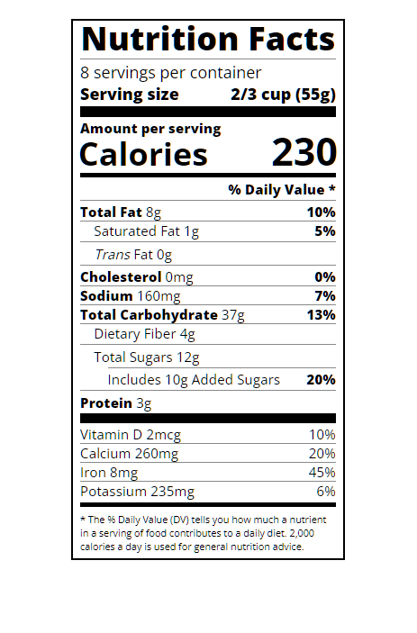

# FreeCodeCamp - Responsive Web Design Certification - Typography Nutrition Label
Project #008

Follow this link for assignment
[Typography Nutrition Label by freeCodeCamp](https://www.freecodecamp.org/learn/2022/responsive-web-design/#learn-typography-by-building-a-nutrition-label)
                                      
### My notes
Nothing fancy, html, css basics, with emphasis on Typography.

